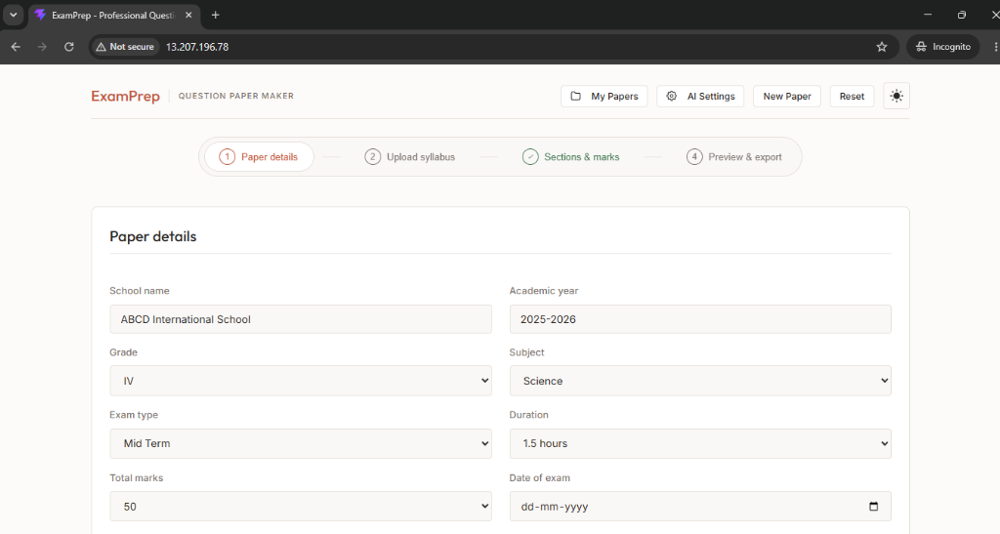
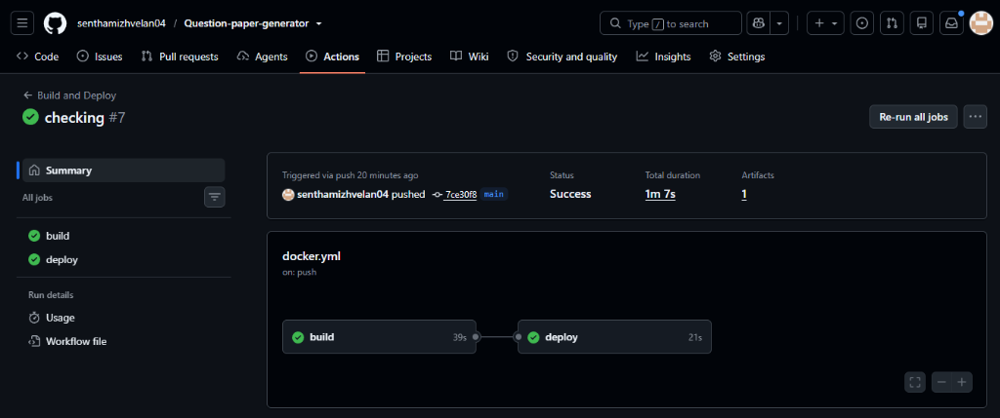
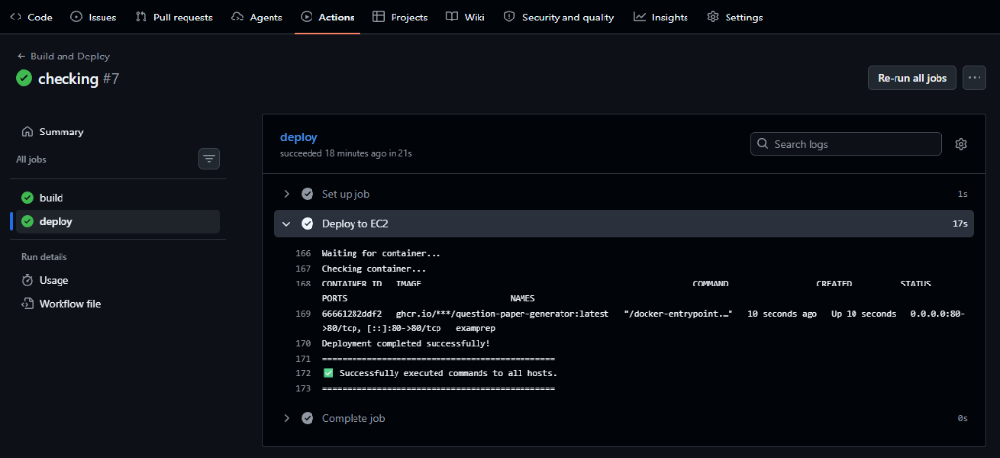
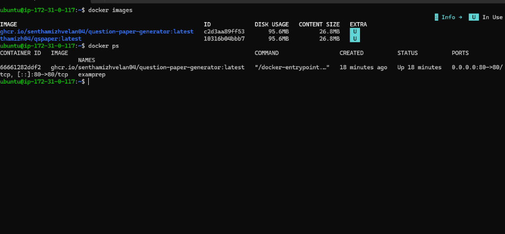

# ExamPrep - AI-Powered Question Paper Generator

A production-grade AI-powered question paper generation platform, containerized with Docker and deployed on AWS EC2 through a fully automated GitHub Actions CI/CD pipeline.

---

## Live Deployment



The application is live and accessible on an AWS EC2 instance at port 80, served through an Nginx reverse proxy inside a Docker container.

---

## Table of Contents

- [Project Summary](#project-summary)
- [Cloud and DevOps Architecture](#cloud-and-devops-architecture)
- [CI/CD Pipeline](#cicd-pipeline)
- [Docker Implementation](#docker-implementation)
- [AWS EC2 Deployment](#aws-ec2-deployment)
- [Deployment Proof](#deployment-proof)
- [Security and Secrets Management](#security-and-secrets-management)
- [Application Features](#application-features)
- [AI Integration](#ai-integration)
- [Technology Stack](#technology-stack)
- [Local Development](#local-development)
- [Running with Docker Locally](#running-with-docker-locally)
- [DevOps Concepts Demonstrated](#devops-concepts-demonstrated)
- [Troubleshooting Experience](#troubleshooting-experience)
- [Learning Outcomes](#learning-outcomes)
- [Future Improvements](#future-improvements)
- [Author](#author)

---

## Project Summary

ExamPrep is a full-stack web application that helps educators create professional, print-ready examination papers. The application demonstrates practical Cloud and DevOps implementation alongside a functional AI-powered product.

**What this project demonstrates:**

- End-to-end CI/CD pipeline using GitHub Actions
- Docker multi-stage builds for production-optimized images
- Automated deployment to AWS EC2 via SSH
- Container lifecycle management in production
- GitHub Container Registry (GHCR) for image storage
- Nginx as a production web server
- Infrastructure security using GitHub Secrets

**What the application does:**

- Configures examination details (school, grade, subject, marks, duration)
- Analyzes syllabus content using AI (Google Gemini / Groq)
- Generates questions across multiple types and difficulty levels
- Provides real-time analytics on marks distribution and difficulty balance
- Exports question papers as PDF, Word (.docx), or print-ready format
- Manages multiple papers with auto-save to browser storage

---

## Cloud and DevOps Architecture

The application follows a standard containerized deployment architecture on AWS.

```
                         Developer Workstation
                                 |
                                 | git push (main branch)
                                 v
                        +------------------+
                        |     GitHub       |
                        |   Repository     |
                        +--------+---------+
                                 |
                                 | Triggers GitHub Actions
                                 v
                        +------------------+
                        | GitHub Actions   |
                        |                  |
                        | 1. Build Stage   |
                        |    - Checkout    |
                        |    - Docker Build|
                        |                  |
                        | 2. Deploy Stage  |
                        |    - SSH to EC2  |
                        |    - Pull Image  |
                        |    - Run Container|
                        +--------+---------+
                                 |
                    +------------+------------+
                    |                         |
                    v                         v
           +------------------+      +------------------+
           |      GHCR        |      |     AWS EC2      |
           | GitHub Container |      |     Ubuntu       |
           |   Registry       |      |                  |
           |                  |      |  Docker Engine   |
           | Stores built     |      |       |          |
           | Docker images    |      |       v          |
           +------------------+      |  Nginx Container |
                                     |       |          |
                                     |       v          |
                                     |  ExamPrep App    |
                                     |  (Port 80)       |
                                     +------------------+
```

---

## CI/CD Pipeline

The project uses a GitHub Actions workflow (`.github/workflows/docker.yml`) that triggers automatically on every push to the `main` branch.

### Pipeline Stages

```
git push to main
       |
       v
+----------------------------------------------+
|              BUILD JOB                        |
|                                               |
|  1. Checkout source code                      |
|  2. Authenticate with GHCR                    |
|  3. Set up Docker Buildx                      |
|  4. Build Docker image (multi-stage)          |
|  5. Push image to GHCR with tags:             |
|     - ghcr.io/senthamizhvelan04/              |
|       question-paper-generator:latest         |
|     - ghcr.io/senthamizhvelan04/              |
|       question-paper-generator:<commit-sha>   |
+----------------------------------------------+
       |
       | (depends on build success)
       v
+----------------------------------------------+
|              DEPLOY JOB                       |
|                                               |
|  1. SSH into AWS EC2 instance                 |
|  2. Authenticate with GHCR on EC2             |
|  3. Pull latest Docker image                  |
|  4. Stop existing container                   |
|  5. Remove existing container                 |
|  6. Start new container with:                 |
|     --restart unless-stopped                  |
|     -p 80:80                                  |
|  7. Wait 10 seconds for startup               |
|  8. Verify container is running (docker ps)   |
+----------------------------------------------+
```

### Workflow Configuration

The workflow file is located at `.github/workflows/docker.yml` and uses the following GitHub Actions:

| Action | Version | Purpose |
|---|---|---|
| actions/checkout | v4 | Clone repository |
| docker/login-action | v3 | Authenticate with GHCR |
| docker/setup-buildx-action | v3 | Set up Docker Buildx builder |
| docker/build-push-action | v6 | Build and push Docker image |
| appleboy/ssh-action | v1.2.2 | SSH into EC2 for deployment |

### Image Tagging Strategy

Every build produces two image tags:

```
ghcr.io/senthamizhvelan04/question-paper-generator:latest
ghcr.io/senthamizhvelan04/question-paper-generator:<commit-sha>
```

The `latest` tag is used for deployment. The commit-SHA tag provides traceability and enables rollback to any previous build.

---

## Docker Implementation

### Multi-Stage Dockerfile

The application uses a two-stage Docker build to minimize the production image size.

**Stage 1 - Build (Node.js)**

```dockerfile
FROM node:22-alpine AS build

WORKDIR /app

COPY package*.json ./
RUN npm ci

COPY . .
RUN npm run build
```

- Uses Node.js 22 Alpine as the build environment
- Installs exact dependency versions with `npm ci`
- Runs `vite build` to produce optimized static files in `dist/`

**Stage 2 - Production (Nginx)**

```dockerfile
FROM nginx:alpine

COPY --from=build /app/dist /usr/share/nginx/html

EXPOSE 80

CMD ["nginx", "-g", "daemon off;"]
```

- Uses Nginx Alpine as the production server
- Copies only the built static files from Stage 1
- Serves the React application on port 80
- Node.js, npm, and source code are excluded from the final image

### Build Optimization

```
Build Stage (Node.js 22 Alpine)
       |
       | npm ci + vite build
       v
   dist/ folder (~2 MB static files)
       |
       | COPY --from=build
       v
Production Stage (Nginx Alpine)
       |
       v
Final Image: ~27 MB (vs ~400 MB+ without multi-stage)
```

### .dockerignore

The following are excluded from the Docker build context to reduce build time and image size:

```
node_modules
dist
.git
.gitignore
npm-debug.log*
```

---

## AWS EC2 Deployment

### Server Configuration

```
Cloud Provider   : Amazon Web Services (AWS)
Service          : EC2 (Elastic Compute Cloud)
Operating System : Ubuntu
Container Runtime: Docker
Web Server       : Nginx (inside container)
Application Port : 80
Restart Policy   : unless-stopped
```

### Network Flow

```
Internet (HTTP Request)
       |
       v
AWS EC2 Instance (Public IP, Port 80)
       |
       v
Docker Container (Port 80 mapped)
       |
       v
Nginx (serves static files)
       |
       v
ExamPrep React Application
```

### Container Configuration

The production container runs with the following flags:

```bash
docker run -d \
  --name examprep \
  --restart unless-stopped \
  -p 80:80 \
  ghcr.io/senthamizhvelan04/question-paper-generator:latest
```

| Flag | Purpose |
|---|---|
| `-d` | Run container in detached (background) mode |
| `--name examprep` | Assign a named identifier to the container |
| `--restart unless-stopped` | Auto-restart on crash or server reboot |
| `-p 80:80` | Map host port 80 to container port 80 |

---

## Deployment Proof

### GitHub Actions - CI/CD Pipeline Execution



The screenshot shows a successful run of the `Build and Deploy` workflow. The pipeline completed both stages:
- **Build**: 39 seconds - Docker image built and pushed to GHCR
- **Deploy**: 21 seconds - Image pulled and container started on EC2

### GitHub Actions - Deployment Logs



The deployment logs confirm:
- SSH connection to EC2 was successful
- Container started and verified as running
- `docker ps` output shows the container is up with correct port mappings
- Deployment completed successfully

### Docker Image and Container on EC2



The EC2 terminal shows:
- `docker images`: The GHCR image is pulled and available locally (95.6 MB disk, 26.8 MB content)
- `docker ps`: The container named `examprep` is running, mapped on port 80, using the GHCR image

### Application Running on AWS EC2


The application is accessible via the EC2 public IP address on port 80, showing the Paper Details form (Step 1 of the 4-step workflow).

---

## Security and Secrets Management

All sensitive credentials are stored as GitHub Repository Secrets and are never committed to the source code.

| Secret | Purpose |
|---|---|
| `EC2_HOST` | Public IP or hostname of the AWS EC2 instance |
| `EC2_USER` | SSH username for the EC2 instance (e.g., `ubuntu`) |
| `EC2_SSH_KEY` | Private SSH key for EC2 authentication |
| `GHCR_USERNAME` | GitHub username for container registry authentication |
| `GHCR_TOKEN` | GitHub Personal Access Token for GHCR login on EC2 |

The `GITHUB_TOKEN` is used in the build job for GHCR authentication and is automatically provided by GitHub Actions.

---

## Application Features

### Four-Step Question Paper Builder

```
Step 1: Paper Details       --> Configure school, grade, subject, marks, duration
Step 2: Upload Syllabus     --> Upload PDF/TXT or paste syllabus text
Step 3: Sections and Marks  --> Add sections, generate questions, assign marks
Step 4: Preview and Export  --> Preview in A4 format, export as PDF/Word/Print
```

### Smart Paper Configuration

- School name and academic year
- Grade selection (III through VI)
- Subject selection
- Examination type (Mid Term, Final, Unit Test, etc.)
- Duration, total marks, date
- Custom title and special instructions

### AI-Powered Syllabus Analysis

Upload syllabus content in PDF, TXT, or pasted text format. The AI extracts:

- Major topics and chapters
- Key learning points for each topic
- Estimated difficulty level per topic

### Question Generation

Nine question types are supported:

| Type | Description |
|---|---|
| MCQ | Multiple choice with 4 options |
| Fill in the Blanks | Sentence completion |
| True / False | Statement verification |
| Short Answer | 2-3 sentence responses |
| Long Answer | Detailed essay responses |
| Match the Columns | Column-based matching |
| Draw and Label | Diagram-based questions |
| Solve / Calculate | Numerical and step-by-step problems |
| Custom | User-defined question formats |

Questions can be generated at three difficulty levels: Easy, Medium, and Hard.

### Built-in Question Bank

A curated question bank is included with pre-built questions across multiple grades and subjects. Questions can be filtered by grade, subject, type, difficulty, and keyword search. Selected questions can be imported directly into the paper.

### Real-Time Analytics

While building a paper, the application tracks:

- Marks assigned vs. target marks
- Estimated examination duration
- Difficulty distribution across questions
- Question type distribution

### Preview and Export

The generated paper can be previewed in A4 format with:

- Question paper view and answer key view
- Multi-page formatting with page numbers
- Section headers and student information fields
- Signature lines and print-specific styling

Supported export formats: PDF, Microsoft Word (.docx), Print, and Copy as Text.

### Multi-Paper Management

- Create, rename, duplicate, and delete papers
- Switch between papers
- Auto-save to browser local storage

---

## AI Integration

### Supported Providers

| Provider | Model | Role |
|---|---|---|
| Google Gemini | Gemini 2.0 Flash | Primary AI provider |
| Groq | Llama 3.3 70B Versatile | Secondary AI provider |

### AI Capabilities

- Syllabus analysis and topic extraction
- Question generation based on syllabus content
- Difficulty-aware question generation
- Question-type-specific generation
- Bulk question generation for sections

### Automatic Failover

```
User Request
     |
     v
Primary Provider (configured by user)
     |
     +-- Success --> Return generated result
     |
     +-- Failure / Rate Limit / Error
            |
            v
     Secondary Provider (automatic fallback)
            |
            +-- Success --> Return generated result
            |
            +-- Failure --> Return error to user
```

If the primary AI provider fails (rate limit, invalid key, network error), the application automatically attempts the other configured provider. A local text-parsing fallback is also available when no API keys are configured.

### API Key Management

API keys are stored in browser `localStorage` and are never sent to any backend server. Requests are made directly from the browser to the respective AI provider APIs.

---

## Technology Stack

### Application

| Technology | Version / Detail | Purpose |
|---|---|---|
| React | 19.x | Frontend UI framework |
| Vite | 8.x | Build tool and dev server |
| JavaScript (ES Modules) | ES2022+ | Application logic |
| HTML5 / CSS3 | - | Structure and styling |

### Document Processing

| Library | Purpose |
|---|---|
| jsPDF | PDF generation |
| html2canvas | HTML to canvas rendering for PDF |
| docx | Microsoft Word document generation |
| PDF.js (via CDN) | PDF file parsing for syllabus upload |

### AI Providers

| Provider | Model | API |
|---|---|---|
| Google Gemini | Gemini 2.0 Flash | REST API (generativelanguage.googleapis.com) |
| Groq | Llama 3.3 70B Versatile | REST API (api.groq.com) |

### Cloud and DevOps

| Technology | Purpose |
|---|---|
| AWS EC2 | Cloud compute instance (Ubuntu) |
| Docker | Application containerization |
| Nginx | Production web server (Alpine) |
| GitHub Actions | CI/CD pipeline automation |
| GitHub Container Registry (GHCR) | Docker image storage |
| SSH | Remote server deployment |
| Git / GitHub | Version control and collaboration |

---

## Local Development

### Prerequisites

- Node.js 18 or higher
- npm
- Git

### Setup

```bash
git clone https://github.com/senthamizhvelan04/Question-paper-generator.git
cd Question-paper-generator

npm install

npm run dev
```

The development server starts at:

```
http://localhost:5173
```

### AI Configuration (Optional)

To enable AI features, open the application in the browser, click "AI Settings" in the navigation bar, and configure your API key for Google Gemini or Groq. The application works without AI keys using the local fallback generator.

---

## Running with Docker Locally

### Build the Image

```bash
docker build -t examprep .
```

### Run the Container

```bash
docker run -d \
  --name examprep \
  --restart unless-stopped \
  -p 80:80 \
  examprep
```

The application will be available at `http://localhost`.

### Container Management

```bash
# Check running containers
docker ps

# View container logs
docker logs examprep

# Stop the container
docker stop examprep

# Remove the container
docker rm examprep

# Remove the image
docker rmi examprep
```

---

## DevOps Concepts Demonstrated

This project provides hands-on implementation of the following concepts:

**Cloud Computing**
- Provisioning and configuring AWS EC2 instances
- Managing Ubuntu Linux servers remotely
- Security Group configuration for HTTP traffic
- Public IP and port management

**Containerization**
- Writing production Dockerfiles
- Multi-stage Docker builds for image optimization
- Container lifecycle management (create, start, stop, remove)
- Docker restart policies for high availability
- Port mapping between host and container
- .dockerignore for build context optimization

**CI/CD**
- GitHub Actions workflow authoring
- Multi-job pipelines with job dependencies
- Automated Docker image builds on push
- Automated deployment via SSH
- Image tagging with `latest` and commit SHA
- Deployment verification steps

**Container Registry**
- Publishing images to GitHub Container Registry (GHCR)
- Authenticating with GHCR from both CI and remote servers
- Image versioning and tag management

**Web Server**
- Nginx as a static file server
- Nginx configuration in Docker containers
- Serving Single Page Applications (SPA)

**Security**
- GitHub Secrets for credential management
- SSH key-based authentication
- Separation of build-time and deploy-time credentials

---

## Troubleshooting Experience

The following real-world issues were encountered and resolved during deployment.

### Docker Permission Issue on EC2

**Problem**: Docker commands required `sudo` on the EC2 instance.

**Solution**:
```bash
sudo usermod -aG docker ubuntu
```
After reconnecting, Docker commands work without `sudo`.

### EC2 Security Group Configuration

**Problem**: Application was not accessible after deployment.

**Solution**: Configured the EC2 Security Group to allow inbound traffic on port 80 (HTTP) from all sources (0.0.0.0/0).

### Container Replacement Strategy

**Problem**: Deploying a new version requires stopping and removing the existing container.

**Solution**: The deployment script handles this gracefully:
```bash
sudo docker stop examprep || true    # Does not fail if container does not exist
sudo docker rm examprep || true      # Does not fail if container does not exist
sudo docker run -d ...               # Starts new container
```

The `|| true` ensures the pipeline does not fail on first deployment when no existing container is present.

### Deployment Verification

**Problem**: Need to confirm the container started successfully after deployment.

**Solution**: The deployment script includes a 10-second wait followed by `docker ps` to verify the container is running and healthy.

---

## Learning Outcomes

### Cloud and DevOps

- Deploying containerized applications to AWS EC2
- Managing Ubuntu Linux servers via SSH
- Writing production-ready Dockerfiles with multi-stage builds
- Building and pushing Docker images to GHCR
- Using Nginx as a production web server inside containers
- Building end-to-end CI/CD pipelines with GitHub Actions
- Automating deployments through SSH-based remote execution
- Managing secrets and credentials securely in CI/CD
- Troubleshooting real-world cloud deployment issues
- Container lifecycle management in production environments

### Application Development

- Integrating multiple AI providers with automatic failover
- Working with Google Gemini and Groq REST APIs
- Processing PDF documents in the browser
- Generating structured documents (PDF, Word)
- Building multi-step form workflows in React
- Managing application state with browser localStorage

---

## Future Improvements

- HTTPS using SSL/TLS certificates (Let's Encrypt)
- Custom domain with DNS configuration
- AWS Application Load Balancer for high availability
- AWS CloudWatch for monitoring and alerting
- Centralized logging with ELK or CloudWatch Logs
- Docker health checks in the Dockerfile
- Automated deployment rollback on failure
- Infrastructure as Code using Terraform
- Migration to AWS ECR for private image storage
- Docker Compose for multi-container setups
- Blue/Green deployment strategy for zero-downtime updates
- Kubernetes deployment for container orchestration
- AWS VPC architecture with public and private subnets
- IAM-based deployment authentication

---

## Project Structure

```
Question-paper-generator/
|
|-- .github/
|   +-- workflows/
|       +-- docker.yml              # GitHub Actions CI/CD pipeline
|
|-- src/
|   |-- components/
|   |   |-- AIGeneratorModal.jsx    # AI question generation modal
|   |   |-- AISettingsModal.jsx     # AI provider configuration
|   |   |-- AnalyticsPanel.jsx      # Real-time paper analytics
|   |   |-- MyPapersModal.jsx       # Multi-paper management
|   |   |-- QuestionBankModal.jsx   # Built-in question bank
|   |   |-- Step1Details.jsx        # Paper details form
|   |   |-- Step2Sections.jsx       # Sections and questions
|   |   |-- Step3Preview.jsx        # Preview and export
|   |   |-- SyllabusUpload.jsx      # Syllabus upload and analysis
|   |   +-- (UI components)
|   |
|   |-- data/
|   |   +-- questionBank.js         # Curated question bank data
|   |
|   |-- styles/
|   |   |-- App.css                 # Application styles
|   |   +-- print.css               # Print-specific styles
|   |
|   |-- utils/
|   |   |-- aiGenerator.js          # AI provider integration (Gemini/Groq)
|   |   |-- pdfParser.js            # PDF file parsing utility
|   |   |-- questionUtils.js        # Question processing utilities
|   |   +-- toast.js                # Notification utility
|   |
|   |-- App.jsx                     # Main application component
|   +-- main.jsx                    # Application entry point
|
|-- screenshots/
|   |-- application.png             # Application running on EC2
|   |-- docker-container.png        # Docker images and containers on EC2
|   |-- github-actions-deploy.png   # Deployment job logs
|   +-- github-actions-pipeline.png # CI/CD pipeline overview
|
|-- .dockerignore                   # Docker build context exclusions
|-- .gitignore                      # Git tracking exclusions
|-- Dockerfile                      # Multi-stage Docker build
|-- index.html                      # Application entry HTML
|-- package.json                    # Node.js dependencies and scripts
|-- vite.config.js                  # Vite build configuration
+-- README.md                       # Project documentation
```

---

## Repository

https://github.com/senthamizhvelan04/Question-paper-generator

---

## Author

Sen Thamizh

GitHub: https://github.com/senthamizhvelan04
